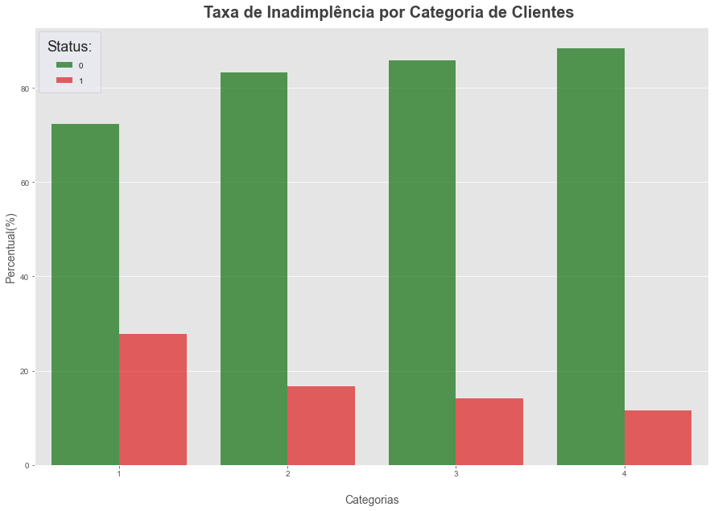
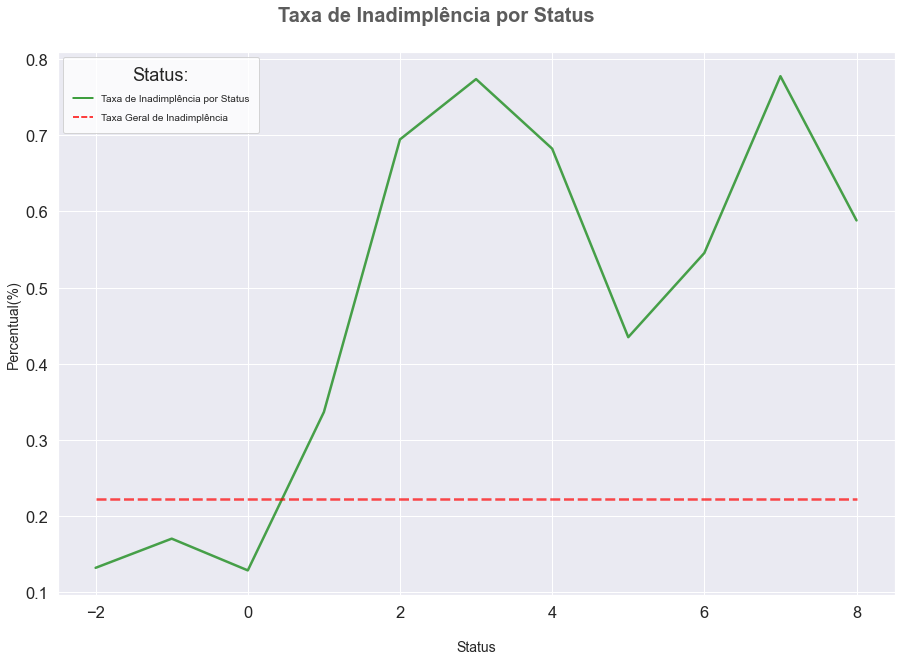
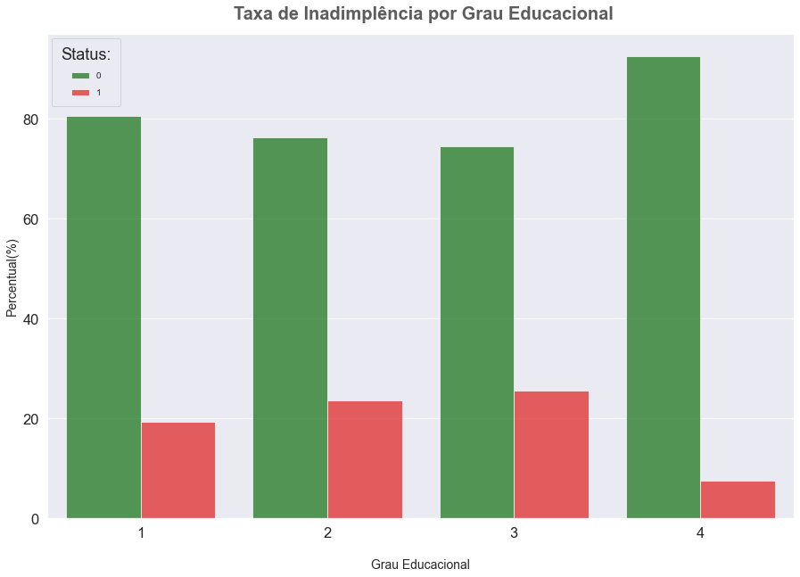
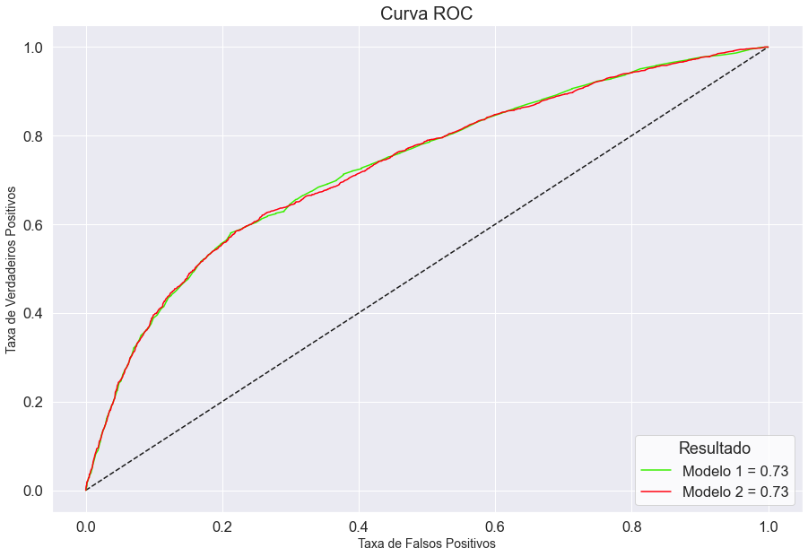
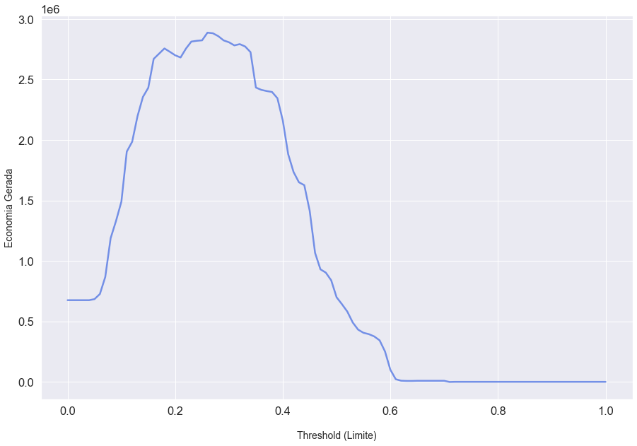

Este é um projeto de classificação.  

O conjunto de dados utilizado está disponível [neste link](https://archive.ics.uci.edu/ml/datasets/default+of+credit+card+clients). 

# Entendimento do Negócio

A ProfitCard é uma instituição financeira em expansão, que fornece empréstimos e financiamentos a seus clientes. Desde a sua fundação, a empresa sempre adotou uma cultura orientada a dados visando sempre otimizar seus resultados e tornar a experiência de seus clientes muito mais completa.

Devido ao grande aumento no volume de solicitações de crédito, a empresa decidiu iniciar um novo projeto de ciência de dados com o objetivo de implementar um programa de aconselhamento aos clientes mais propensos a inadimplir. Nesse programa, o principal objetivo é fornecer um aconselhamento individualizado para o titular da conta de modo a encorajá-lo a acertar suas pendências.

Logo, essa análise tem como objetivo identificar quais clientes possuem as maiores probabilidades de serem contatados e consequentemente pagarem suas dívidas, ou seja, a decisão que o modelo ajudará a tomar é de sim ou não: 

- **Esse cliente deve passar pelo programa de aconselhamento da ProfitCard?**

# Dicionário de Dados

Em relação ao conjunto de dados, as seguintes informações foram disponibilizadas:

- Os dados estão em formato estruturado e serão disponibilizados em um arquivo "xls".
- Os dados financeiros estão em dólares taiwaneses e serão convertidos para facilitar a análise.
- Cada registro do conjunto de dados representa a conta de um cliente, sendo assim, não deve haver registros duplicados.

Além disso, também foi disponibilizado o dicionário de dados:

**OBS:** os significados dos valores presentes em cada variável estão disponíveis no notebook.

| Variáveis                        | Descrição                                       | 
| -------------------------------- | ------------------------------------------------| 
| ID                               | Identificação da conta do cliente               | 
| LIMIT_BAL                        | Valor do crédito fornecido                      | 
| SEX                              | Sexo do cliente                                 | 
| EDUCATION                        | Grau de instrução educacional do cliente        | 
| MARRIAGE                         | Estado civil do cliente                         | 
| AGE                              | Idade do cliente                                |            
| PAY[1 a 6]                       | Status do pagamento mensal                      | 
| BILL_AMT[1 a 6]                  | Valor da fatura mensal                          |
| PAY_AMT[1 a 6]                   | Valor do pagamento mensal realizado             |
| default payment next month       | Variável target                                 |

# Estratégia da Solução

Como estratégia para a solução do projeto, definimos as seguintes etapas:

- **1. Entendimento do Negócio:** nesta etapa inicial, o principal objetivo é compreender o problema de negócio e as necessidades do cliente.

- **2. Entendimento dos Dados:** aqui, iremos realizar um tratamento inicial nos dados a fim de detectar possíveis inconsistências, além disso, iremos explorar as variáveis com o objetivo de entender melhor o que elas representam.

- **3. Engenharia de Atributos:** baseado nos dados existentes, criaremos novas variáveis a fim de resumir as informações e facilitar o aprendizado dos modelos. Além disso, também selecionaremos o conjunto das melhores variáveis.

- **4. Pré-Processamento dos Dados:** nesta etapa, nosso objetivo é preparar os dados para a aplicação do modelo de machine learning, iremos realizar a divisão dos dados em treino e teste, e aplicar técnicas como balanceamento de classes e padronização dos dados.

- **5. Modelagem Preditiva:** iremos testar diferentes algoritmos e escolher o de melhor performance, além de realizar a otimização de seus hiperparâmetros.

- **6. Programa de Aconselhamento de Clientes:** nesta etapa, ajudaremos a ProfitCard a responder a principal pergunta de negócio, identificando os clientes que deverão participar do programa de aconselhamento.

- **7. Conclusões Finais:** por fim, entregaremos o resultado final do projeto.

# TOP 3 Insights 

**P1. O limite de crédito fornecido impacta na taxa de inadimplência?**
- Sim, podemos ver que à medida que o limite de crédito aumenta, a taxa de inadimplência diminui.
- A categoria 1, possui uma taxa de inadimplência quase 3 vezes maior que a categoria 4.

**P2. Clientes inadimplentes tendem a inadimplir novamente?**
- Sim, podemos ver que clientes inadimplentes (valores a partir de 1) apresentam maiores probabilidades de inadimplir novamente.
- De acordo com a análise, pelo menos 30% das contas que estavam inadimplentes no último mês (valor 1), estarão inadimplentes novamente.
- Por outro lado, as contas em boa situação (-2, -1, e 0) estão bem abaixo da taxa geral de inadimplência.

**P3. Há diferenças significativas na taxa de inadimplência baseado no grau de instrução educacional?**
- Não, embora haja uma diferença entre as classes, ela não é significativa.
- A classe 4 (Outros) é a que demonstra a menor taxa de inadimplência.

# Modelagem Preditiva

A fim de identificar quais os melhores algoritmos que poderíamos utilizar na modelagem preditiva, foi realizado uma pré-seleção, onde treinamos e avaliamos os desempenhos dos principais algoritmos de classificação. Baseado na acurácia, o *RandomForestClassifier* foi o escolhido. 

| *LogisticRegression* | *LinearDiscriminantAnalysis* | *KNeighborsClassifier* | *DecisionTreeClassifier* | *RandomForestClassifier* |
|:--------------------:|:----------------------------:|:----------------------:|:------------------------:|:------------------------:|
| 0.685421	           | 0.687394	                    | 0.736187               | 0.734098                 | 0.803205                 |

Após decidirmos qual algoritmo seria utilizado, dois modelos foram criados:  

- **Modelo 1:** treinado com as configurações padrão. 
- **Modelo 2:** treinado utilizando a otimização dos hiperparâmetros.

Os resultados foram bastante similares, a otimização desses hiperparâmetros não impactaram as métricas do modelo, sendo assim, o Modelo 1 foi o escolhido para a entrega final por se tratar de uma versão mais "simplificada". Abaixo podemos visualizar as métricas do modelo.

| Modelo 1             | *Precision*                  | *Recall*               | *F1-score*               | 
|:--------------------:|:----------------------------:|:----------------------:|:------------------------:|
| Classe 0             | 0.86                         | 0.79                   | 0.83                     |
| Classe 1       	     | 0.45                         | 0.56                   | 0.50                     |

# Programa de Aconselhamento de Clientes

Após a etapa de modelagem, precisamos definir quais clientes deveriam participar do programa de aconselhamento da ProfitCard. Para essa tarefa, precisamos definir um valor limite ideal, ou seja, qual a probabilidade de inadimplência que um cliente necessita ter para participar do programa de aconselhamento.  

Além disso, foi nos informado que o custo por sessão do programa é de R$1.200,00 e a taxa de sucesso esperada é de 70%. 

Para calcular a possível economia que o programa de aconselhamento trouxe para a ProfitCard, precisávamos saber o valor da fatura do próximo mês, porém, como não tínhamos essa informação, utilizamos a média dos valores da fatura mais recente, ou seja, a média da variável **`BILL_AMT1`**.

Com base em nossas análises, o valor limite ideal foi de 0.26, conforme mostra o gráfico abaixo.

# Conclusões Finais

Os dois modelos avaliados apresentaram bons resultados, porém, o modelo 1 foi o escolhido por ser mais "simples". Para um primeiro ciclo, conseguimos um bom resultado, embora, o modelo tenha maior dificuldade em prever amostras da classe positiva com um *recall* de 56%, ainda assim, conseguimos uma acurácia total de 74%.

Após a etapa de modelagem, tivemos que identificar qual o valor limite ideal para considerar se um cliente deveria ou não receber o aconselhamento. Com base em nossa análise o valor limite ideal foi de 0.26, ou seja, clientes que possuem 26% de chances de inadimplir devem participar do programa. Considerando os custos por cada sessão, com nosso modelo, conseguiríamos uma economia líquida de **R$ 2.887.081,19**, o que representa uma diminuição de **21,6%** dos custos supondo a ausência do programa de aconselhamento.

Por fim, para um segundo ciclo do projeto, poderíamos utilizar abordagens diferentes em ralação ao tratamento de valores ausentes, padronização dos dados, seleção das melhores variáveis, e a otimização de outros algoritmos de classificação.

# Autor

Rafael Felippe  

